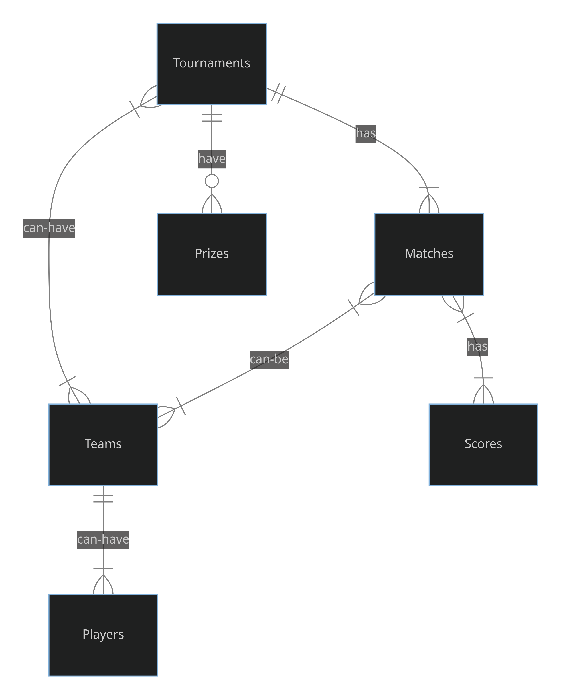

# Design Document

By Aniket Nalegaonkar

## Scope

In this section you should answer the following questions:

* What is the purpose of your database?
* Which people, places, things, etc. are you including in the scope of your database?
* Which people, places, things, etc. are *outside* the scope of your database?

This database serves as a central hub for all things Valorant esports. It aims to streamline the organization and tracking of various Valorant tournaments by storing and managing information about:

* Tournaments: Details like names, descriptions, dates, locations, organizers, statuses, and winners.
* Teams: Information on team names, captains, contact details, and even logo URLs.
* Players: Data about individual players, including usernames, emails, and their affiliated teams.
* Matches: Specific details for each match, such as tournament ID, participating team IDs, date/time, winning team, and even match status.
* Scores: Granular scores for each match, linking them to the specific match and participating team.
* Prizes: Information on prizes offered at tournaments, including descriptions and values.

Here's what you won't find:

* Information on any esports events outside of Valorant.

## Functional Requirements

In this section you should answer the following questions:

* What should a user be able to do with your database?
* What's beyond the scope of what a user should be able to do with your database?

This database empowers you to manage and retrieve information specific to Valorant esports. Here's what you can do:

**Data Retrieval:**

* Access detailed information about Valorant tournaments, teams, players, matches, scores, and prizes.

**Data Manipulation:**

* Add: Introduce new entries for tournaments, teams, players, matches, scores, and prizes.
* Update: Modify existing information within the database, such as tournament statuses, team captains, player emails, match scores, and prize values.
* Delete: Remove outdated or unnecessary data entries to maintain a clean and organized database.

**Security Considerations:**

* Limited Modifications: Users cannot alter the fundamental structure of the database (e.g., table schemas).
* Valorant-Focused: Access is restricted to Valorant esports data, excluding information from other esports titles.
* Data Integrity: Non-administrative users lack the ability to drop or truncate tables, ensuring data remains protected.

## Representation

### Entities

In this section you should answer the following questions:

* Which entities will you choose to represent in your database?
* What attributes will those entities have?
* Why did you choose the types you did?
* Why did you choose the constraints you did?

The database centers around six core entities, each representing a vital aspect of the Valorant esports ecosystem:

* Tournaments: Encompasses details like names, descriptions, dates, locations, organizers, statuses (ongoing, upcoming, completed), winners, and more.
* Teams: Captures information on team names, captains, contact details, and even logo URLs.
* Players: Stores data about individual players, including usernames, emails, and their affiliated teams.
* Matches: Provides specifics for each match, such as the associated tournament, participating teams (through foreign keys), date/time, winning team, and status (scheduled, completed).
* Scores: Records granular scores for each match, linking them to the specific match and participating team (again, using foreign keys).
* Prizes: Offers information on prizes awarded at tournaments, including descriptions and values.

Each entity is comprised of various attributes that define its characteristics. Here's a breakdown of the chosen data types:

* TEXT: Ideal for storing textual data like names, descriptions, locations, and other similar elements.
* INTEGER: Perfect for numerical identifiers like IDs, scores, and prize values.
* DATE: Specifically designed to handle dates such as tournament start and end dates.
* DATETIME: Captures the specific date and time of matches.

Constraints act as the guardians of data integrity, ensuring accuracy and consistency within the database:

* PRIMARY KEY: Assigns a unique identifier to each entity, preventing duplicates.
* NOT NULL: Enforces that specific fields must always be filled with a value.
* FOREIGN KEY: Guarantees referential integrity by ensuring relationships between entities are valid (e.g., a player must belong to an existing team).
* CHECK: Imposes specific conditions on certain fields. For instance, a tournament's status can only be "ongoing," "upcoming," or "completed."

These constraints collectively ensure efficient data storage, minimize errors, and establish meaningful connections between the various entities within the Valorant Esports Database.

### Relationships

In this section you should include your entity relationship diagram and describe the relationships between the entities in your database.

**Tournaments and Matches (One-to-Many):**
Each tournament can have many matches.
This is represented by the "tournament_id" foreign key in the "Matches" table, referencing the "tournament_id" primary key in the "Tournaments" table.

**Tournaments and Teams (Many-to-Many):**
Many tournaments can have many teams participating.
This is indirectly represented through the "Matches" table. Each match involves two teams, and matches are associated with tournaments.
Tournaments are connected to teams through the matches they participate in.

**Teams and Players (One-to-Many):**
Each team can have many players.
This is represented by the "team_id" foreign key in the "Players" table, referencing the "team_id" primary key in the "Teams" table.

**Matches and Scores (One-to-Many):**
Each match can have multiple scores (one for each team).
This is represented by the "match_id" foreign key in the "Scores" table, referencing the "match_id" primary key in the "Matches" table.

**Tournaments and Prizes (One-to-Many):**
Each tournament can have multiple prizes.
This is represented by the "tournament_id" foreign key in the "Prizes" table, referencing the "tournament_id" primary key in the "Tournaments" table.

## Optimizations

In this section you should answer the following questions:

* Which optimizations (e.g., indexes, views) did you create? Why?

**Indexes:**

* "score_index" on "Scores" table for the "score" column: This index is beneficial for quick lookups and filtering based on scores in matches.
* "match_winner_index" on "Matches" table for the "winner_team_id" column: This index helps in efficient retrieval of matches based on their winner team.
* "tournament_index" on "Tournaments" table for columns "name", "organizer", "status": This index improves search performance when filtering tournaments by name, organizer, or status.
* "lineups_index_t" and "lineups_index_p" on "lineups" view for columns "team_name" and "player_name" respectively: These indexes enhance the search efficiency when querying team names or player names from the "lineups" view.

**Views:**

* "upcoming_tournaments": This view filters and displays upcoming tournaments, providing a convenient way to view only relevant information.
* "ongoing_tournaments": Similar to the above, this view presents ongoing tournaments' details.
* "completed_tournaments": Shows details of completed tournaments including the winner team, for easy reference.
* "lineups": This view combines team names and player names, facilitating a quick overview of team rosters.

These optimizations were implemented to enhance query performance and provide users with efficient ways to access and analyze the data. Indexes speed up searches and lookups on frequently accessed columns, while views offer pre-defined perspectives on the data, simplifying common queries and improving usability.

## Limitations

In this section you should answer the following questions:

* What are the limitations of your design?
* What might your database not be able to represent very well?

**Design Limitations:**

* Tournament Twists: The design might not adapt to intricate tournament formats like group stages, multi-round brackets, or player substitutions.
* History in the Shadows: Limited historical data storage hinders in-depth analysis of past events.
* Data Duplication Danger: While foreign keys help, there's no safeguard to prevent a player from being mistakenly assigned to multiple teams.
* Single Spotlight on Prizes: The design assumes one prize per tournament, not catering to scenarios with multiple prizes.

**Beyond the Database:**

* Real-time Jitters: The current setup might not handle real-time updates during matches, especially with high user concurrency.
* Statistical Snapshots Missing: Advanced player performance metrics or team trends over time would require additional tables.
* Visualizing Victories: The data wouldn't directly translate to tournament bracket visualizations, player heatmaps, or team performance charts.
* Multi-Game Mayhem: Expanding to other esports titles could expose limitations in accommodating new game-specific data.
